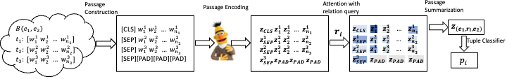

## Official Code for "PARE: A Simple and Strong Baseline for Monolingual and MultilingualDistantly Supervised Relation Extraction"



Please follow the following steps (one by one) to reproduce the results presented in our pre-print:

### 1. Environment Setup
* Our codebase is tested on Python 3.6.13. We recommend creating a conda environment using the command given below.
```
conda create --name your_env_name python=3.6.13
```

* Our codebase is tested on GPUs with cuda version >= 10.2. Please install all of the dependencies using the command given below in the topmost directory (which contains the requirements.txt file)

```
pip install -r requirements.txt
```

### 2. Downloading Datasets
* We present results on four open-source datasets: NYT-10d, NYT-10m, Wiki-20m and DiS-ReX. To reproduce results on each of these datasets, we provide scripts in the "benchmark" folder to download them.
* For downloading NYT-10d, use the following command inside the benchmark folder
```
sh download_nyt10.sh
```
* For downloading NYT-10m, use the following command inside the benchmark folder
```
sh download_nyt10m.sh
```
* For downloading Wiki-20m, use the following command inside the benchmark folder
```
sh download_wiki20m.sh
```
* For downloading DiS-ReX, use the following command inside the benchmark folder
```
sh download_disrex.sh
```

### 3. Training and testing models

* Training scripts are provided in the topmost directory for each of the four datasets. Once the training finishes, the best saved model would automatically be tested on the test set (returning AUC, Macro F1, Micro F1, and P@M)
* To reproduce results on NYT-10d, run
```
sh train_nyt10d.sh
```
* To reproduce results on NYT-10m, run
```
sh train_nyt10m.sh
```
* To reproduce results on Wiki-20m, run
```
sh train_wiki20m.sh
```
* To reproduce results on DiS-ReX, run
```
sh train_disrex.sh
```
### 4. Trained model checkpoint

[link](https://drive.google.com/drive/folders/1vlMzXYiUlwvrCa5Du1O-iXzAl9sVOrIG?usp=sharing)

### 5. P-R Curves

[link](https://drive.google.com/drive/folders/1uhsLbRYayQ86wS2L49syEkgiuYCErFEs?usp=sharing)


### Cite
The codebase is a part of the work [PARE: A Simple and Strong Baseline for Monolingual and Multilingual Distantly Supervised Relation Extraction](https://aclanthology.org/2022.acl-short.38/). If you use or extend our work, please cite the following paper:
```
@inproceedings{rathore2022pare,
  title={PARE: A Simple and Strong Baseline for Monolingual and Multilingual Distantly Supervised Relation Extraction},
  author={Rathore, Vipul and Badola, Kartikeya and Singla, Parag and others},
  booktitle={Proceedings of the 60th Annual Meeting of the Association for Computational Linguistics (Volume 2: Short Papers)},
  pages={340--354},
  year={2022}
}
```

### Acknowledgements
Our codebase is built upon [OpenNRE's](https://aclanthology.org/D19-3029.pdf). For more details on the format of the dataset's used, we refer the user to their [repository](https://github.com/thunlp/OpenNRE).

For more details on the DiS-ReX dataset, we refer the user to their [pre-print](https://arxiv.org/abs/2104.08655) as well as their [repository](https://github.com/dair-iitd/DiS-ReX).
